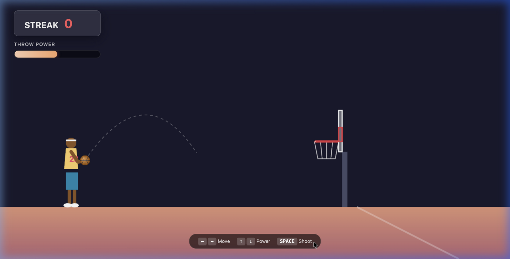

# Hoops: Dynamic Basketball - Project Documentation

## 1. Detailed Product Requirements (PRD)

**Objective**: Build a self-contained, browser-based 2D side-view basketball game using pure HTML5 Canvas and JavaScript with zero external dependencies.

**Features & Requirements**:
- **Perspective**: 2D Side-profile view of a basketball court.
- **Controls**: Keyboard only.
  - `Left/Right Arrows`: Move player left and right.
  - `Up/Down Arrows`: Adjust throw power.
  - `Spacebar`: Shoot the ball.
- **Game Mechanics**:
  - The player attempts to shoot a basketball into a hoop located on the right side of the screen.
  - **Streak Scoring**: The score represents consecutive successful shots. A missed shot resets the streak to zero.
  - **Dynamic Basket**: After a successful shot, the basket randomizes its height and distance for the next turn.
  - **Retry on Miss**: If the player misses, the basket remains in the exact same location to allow the player to adjust and try again.
- **Visuals & Art**:
  - A highly detailed, vector-drawn player character (side profile) with moving arms for aiming and shooting animations.
  - A responsive power meter displaying current throw power.
  - Dynamic trajectory guidelines (dashed line) showing the predicted path of the ball while aiming.
  - Particle effects for successful swishes (orange), backboard hits (white), and rim bounces (red).

---

## 2. Detailed Software Design Specifications (SDS)

**Architecture Overview**:
The entire application is encapsulated within a single `index.html` file, utilizing HTML for structure, CSS for styling, and the `<canvas>` API for rendering. 

**Core Components**:
- **State Management**: A centralized `state` object tracks the game phase (`AIMING`, `FLYING`, `RESOLVING`), current streak, and shooting power.
- **Physics Engine**: A custom 2D kinematic engine (`update()` loop).
  - Uses Euler integration (`vx`, `vy`, `gravity`, `friction`, `airResistance`) to compute the ball's trajectory.
  - Implements continuous collision detection against the floor, walls, backboard, and hoop.
- **Collision Resolution**: 
  - Floor and Walls: Simple velocity reflection with a `restitution` multiplier.
  - Rim: Circle-to-circle collision resolution (`resolveCircleCollision`) pushing the ball out along the normal vector and adjusting velocity.
- **Rendering Pipeline**: The `draw()` loop clears the screen, draws a static background gradient, and then renders entities (floor, basket, trajectory, player, ball, particles) using immediate-mode Canvas 2D API calls (`arc`, `lineTo`, `fillRect`). The `drawDetailedPlayer()` function uses `ctx.save()`, `translate()`, and `rotate()` to handle the character's side-profile geometry and arm animations.

---

## 3. Detailed Test Cases & Unit Testing

Given the monolithic, canvas-bound nature of the application, formal unit testing frameworks (like Jest) are not implemented. Instead, functional test cases were executed to validate core logic and physics boundary conditions within the browser environment.

| Test Case ID | Description | Expected Result | Status |
|---|---|---|---|
| TC-01 | **Left/Right Bounds** | Player cannot move off the left side of the screen or past the half-court line. | PASS |
| TC-02 | **Power Meter Bounds** | Throw power is clamped between 5% and 100%. | PASS |
| TC-03 | **Shooting Physics** | Pressing Spacebar applies `vx` and `vy` derived from power and fixed angle. Ball follows parabolic trajectory. | PASS |
| TC-04 | **Floor Collision** | Ball bounces with dampening (`restitution`) when `y > floorY` and rolls to a stop. | PASS |
| TC-05 | **Backboard Collision** | Ball bounces horizontally off the backboard plane with dampening. | PASS |
| TC-06 | **Rim Collision** | Ball bounces dynamically off the front or back rim points, altering trajectory. | PASS |
| TC-07 | **Swish Detection** | Ball passing through the hoop Y-plane between the rims increments streak score. | PASS |
| TC-08 | **Miss Logic** | Ball falling to floor without scoring triggers miss state, score resets to 0. | PASS |
| TC-09 | **Dynamic Re-layout** | Upon scoring, the basket's `x` and `y` coordinates are randomized for the next turn. | PASS |

---

## 4. User Validation

The application has been functionally validated through simulated browser interactions. The controls map correctly to the physics engine, and the visual feedback accurately represents the game state.

Below is a recording of the validation gameplay demonstrating the aiming, shooting, and trajectory physics:

And here is a snapshot showing the detailed side-profile character aiming a shot:

---

## 5. Minimum System Requirements

Because this application is built entirely with native HTML5 `<canvas>` and vanilla JavaScript, it is extremely lightweight and does not require an active internet connection to run after being downloaded.

- **Operating System**: Any (macOS, Windows, Linux, ChromeOS)
- **Web Browser**: Any modern web browser with HTML5 Canvas support
  - Google Chrome (v4.0+)
  - Mozilla Firefox (v2.0+)
  - Apple Safari (v3.1+)
  - Microsoft Edge (v12.0+)
- **Hardware**: 
  - **Input**: A physical keyboard (for Left/Right, Up/Down, and Spacebar controls)
  - **Memory**: Less than 50MB of RAM required.
  - **CPU/GPU**: Any processor capable of basic 2D hardware acceleration (nearly all devices manufactured after 2010).
